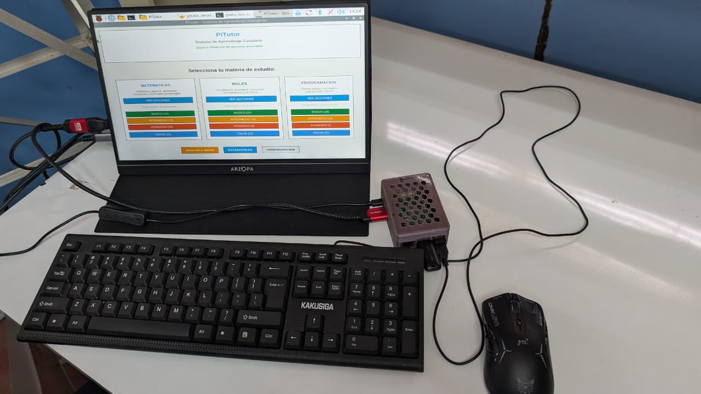
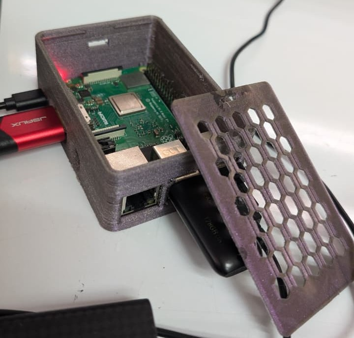
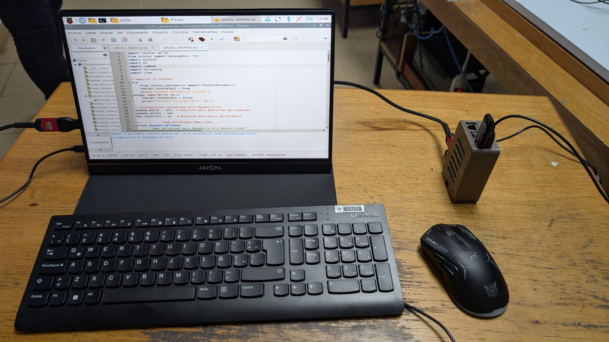
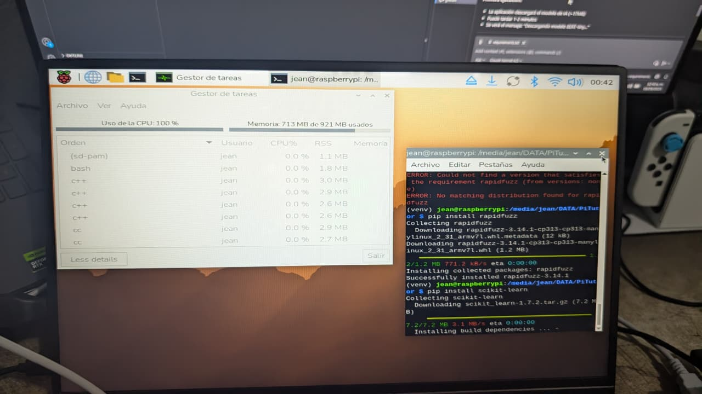

# LearnPi: Tutor Inteligente en Raspberry 3

**Computadoras para Aprender**: Tecnología Educativa Offline para Escuelas Rurales


*Sistema completo funcionando: Raspberry Pi 3 B+*

---

## 🎯 El Desafío: IA Educativa en Hardware Extremadamente Limitado

En 2025, los sistemas de tutoría inteligente modernos consumen **+4GB de RAM** y requieren conectividad constante. Pero en escuelas rurales de Panamá, los estudiantes no tienen acceso a internet ni a computadoras potentes.

**¿La solución?** Demostramos que es posible crear un **tutor inteligente funcional** en una **Raspberry Pi 3 B+** con apenas **1GB de RAM**, alimentado por **energía solar** y funcionando 100% offline.

### 💡 El Concepto

> *"Si logramos un tutor inteligente con 1GB de RAM, imagina lo que podríamos hacer con solo un poco más de recursos en escuelas rurales."*

Este proyecto prueba que la **IA educativa accesible** no requiere hardware costoso ni conexión a internet. Es el punto de partida para llevar educación tecnológica a lugares donde hoy no existe.

---

## 🚀 Características Principales (Lo que Logramos)

### Hardware Completo de Bajo Costo


*Componentes del prototipo: Raspberry Pi 3 B+ con carcasa impresa en 3D*

* **Computadora**: Raspberry Pi 3 B+ (1GB RAM, procesador ARM Cortex-A53)
* **Periféricos**: Teclado USB económico + Mouse óptico + Pantalla LCD básica
* **Energía Autónoma**: Panel solar pequeño (10W) + Batería portátil recargable
* **Costo Total Estimado**: ~$120 USD (accesible para proyectos educativos)


*Pruebas del entorno Raspberry OS Lite + IDE Python (Geany)*

### Software Super-Ligero
* **Tutor Offline**: Funciona sin internet, sin depender de APIs externas
* **IA Práctica (No Pesada)**: Validación semántica con librerías mínimas desentrañadas:
  * Sin TensorFlow, PyTorch o modelos transformer (demasiado pesados)
  * Usa RapidFuzz (fuzzy matching puro) + reglas semánticas custom
  * Ocupa **<50MB de RAM** en reposo, **<150MB** en ejecución activa
* **3 Materias**: Matemáticas, Inglés y Programación (Python)
* **Interfaz Ultra-Ligera**: Tkinter nativo (sin frameworks pesados)
* **Base de Datos Local**: SQLite embebida (sin servidores)

### Validación Inteligente (IA Ligera)
* Detecta sinónimos técnicos (ej: *print = imprimir = mostrar = escribir*)
* Tolera errores tipográficos comunes (fuzzy matching al 85-95%)
* Normaliza respuestas de código Python para comparación semántica
* Adapta umbrales según longitud de respuesta (preguntas cortas vs largas)
* **Todo sin modelos de lenguaje grandes**: solo reglas + estadística básica

---

## 🏆 Hackathon Samsung Innovation Campus (SIC – 2025)

### El Reto Original
*"Crear un concepto de computadora educativa usando hardware reciclado o de bajo costo, basado en Raspberry Pi (incluso versiones antiguas con especificaciones reducidas), con aplicaciones ligeras e IA optimizada capaces de funcionar sin conexión a internet."*

### Nuestra Respuesta Técnica

#### 1️⃣ **Desafío RAM: 1GB vs 4GB+**
Los tutores inteligentes actuales (ChatGPT, Gemini, Claude) requieren GPU y GBs de VRAM. Nosotros:
- **Desentrañamos librerías**: Eliminamos dependencias pesadas (NumPy/SciPy completos de scikit-learn)
- Usamos solo **RapidFuzz** (implementación Levenshtein en C++) para matching rápido
- Implementamos lógica custom en **Python puro** para sinónimos y validación semántica
- **Resultado**: Sistema funcional en **~150MB** de RAM (vs 4GB+ de alternativas cloud)

#### 2️⃣ **Desafío Energía: Sin Acceso a Red Eléctrica**
- Panel solar compacto (10W) carga batería de 10,000mAh durante el día
- La Raspberry Pi 3 B+ consume ~2.5W en uso normal
- **Autonomía**: 4-6 horas de uso continuo con batería cargada
- Ideal para escuelas sin electricidad estable

#### 3️⃣ **Desafío Conectividad: 100% Offline**
- Sin APIs, sin internet, sin actualizaciones en la nube
- Toda la lógica educativa (90+ ejercicios, 13 lecciones) en SQLite local
- Validación de respuestas en tiempo real sin latencia de red

#### 4️⃣ **Desafío Usabilidad: Para Niños de 6to Grado**
- Interfaz simple con botones grandes y texto claro
- Retroalimentación inmediata (sin esperar a un servidor)
- Progreso visible (barra de ejercicios, puntuaciones)
- Lecciones con ejemplos paso a paso

---

## 📂 Estructura del Proyecto

```
PiLearn/
├── main.py                   # Punto de entrada (40 líneas)
├── requirements.txt          # Dependencias mínimas (2 librerías)
├── pitutor_raspberry.db      # Base de datos SQLite (ejercicios/lecciones)
├── config/                   # Configuración (colores/constantes)
├── models/                   # Lógica de negocio
│   ├── database.py           # Gestión SQLite
│   ├── validator.py          # IA ligera de validación
│   ├── exercise.py           # Modelo de ejercicios
│   └── lesson.py             # Modelo de lecciones
├── controllers/              # Controladores MVC
│   ├── app_controller.py     # Coordinador principal
│   ├── lesson_controller.py  # Flujo de lecciones
│   └── exercise_controller.py # Flujo de ejercicios
├── views/                    # Vistas Tkinter
│   ├── main_menu_view.py     # Menú principal
│   ├── lesson_view.py        # Visualizador de lecciones
│   ├── exercise_view.py      # Interfaz de práctica
│   └── results_view.py       # Pantalla de resultados
└── components/               # Widgets reutilizables
    └── widgets.py            # Botones/Entradas/Tarjetas
```

**Arquitectura MVC**: Separación clara entre lógica de negocio, interfaz y flujo de control.

---

## 🛠️ Instalación y Configuración

> **Importante**: Este proyecto está optimizado para Raspberry Pi OS Lite, pero funciona en cualquier sistema con Python 3.7+

### Opción A: En Raspberry Pi 3 B+ (Hardware Real)

#### 1️⃣ Preparar el Sistema
```bash
# Actualizar sistema
sudo apt update && sudo apt upgrade -y

# Instalar dependencias del sistema
sudo apt install python3-tk python3-pip -y
```

#### 2️⃣ Instalar Proyecto
```bash
# Clonar o copiar el proyecto
cd /home/pi/
git clone https://github.com/tu-usuario/PiLearn.git
cd PiLearn

# Instalar dependencias Python
pip3 install -r requirements.txt
```

#### 3️⃣ Ejecutar
```bash
python3 main.py
```


*Sistema ejecutándose nativamente en Raspberry Pi 3 B+ - consumo de RAM <150MB*

### Opción B: En Windows/Mac/Linux (Para Desarrollo)

#### 1️⃣ Crear Entorno Virtual
```bash
python -m venv .venv
```

#### 2️⃣ Activar Entorno
* **PowerShell (Windows):**
  ```powershell
  .\.venv\Scripts\activate
  ```
* **Linux / Mac:**
  ```bash
  source .venv/bin/activate
  ```

#### 3️⃣ Instalar Dependencias
```bash
pip install -r requirements.txt
```

#### 4️⃣ Ejecutar
```bash
python main.py
```

---

## ⚡ Guía de Uso

1. **Selecciona** materia (Matemáticas / Inglés / Programación) y nivel (Básico / Intermedio / Avanzado)
2. **Decide** si quieres aprender con lecciones primero o practicar directo
3. **Estudia** lecciones con teoría, ejemplos y consejos
4. **Practica** ejercicios con validación inteligente en tiempo real
5. **Revisa** resultados y estadísticas de tu sesión
6. **Repite** para reforzar aprendizaje

---

## 📊 Datos Técnicos del Proyecto

### Consumo de Recursos (Medido en Raspberry Pi 3 B+)
| Métrica | Valor |
|---------|-------|
| **RAM en reposo** | ~40-50 MB |
| **RAM en uso activo** | ~120-150 MB |
| **CPU promedio** | 15-25% (1 core) |
| **Almacenamiento** | ~15 MB (código + BD) |
| **Consumo energético** | ~2.5W |
| **Tiempo de arranque** | <5 segundos |

### Contenido Educativo
| Categoría | Cantidad |
|-----------|----------|
| **Ejercicios totales** | 90+ |
| **Lecciones** | 13 |
| **Materias** | 3 |
| **Niveles de dificultad** | 3 |

### Tecnologías Usadas
* **Lenguaje**: Python 3.7+
* **GUI**: Tkinter (nativo, sin instalación extra)
* **Base de Datos**: SQLite3 (embebida)
* **IA/Validación**: RapidFuzz (fuzzy matching) + lógica custom
* **Arquitectura**: MVC (Modelo-Vista-Controlador)

---

## 📄 Formulario de Desarrollo (SIC – 2025)

### Equipo - Pandas Con Flow

| Integrante | Rol |
|------------|-----|
| Jean Gómez | Coordinador y desarrollador Python |
| Kelvin He | Optimización y rendimiento |
| Jorge Rodríguez | Aplicaciones educativas e IA |
| Oriel Pinilla | Documentación y presentación |

### Valor Diferencial

**Innovación técnica**: Desentrañamos librerías para reducir consumo de RAM de 4GB+ (tutores IA convencionales) a **<150MB**, haciendo viable la tutoría inteligente offline en hardware de $120.

**Impacto social**: Demuestra que tecnología educativa de calidad puede llegar a escuelas sin electricidad ni internet mediante energía solar y validación semántica ligera.

### Preguntas Clave Resueltas

✅ **¿Funciona IA en 1GB?** → Sí. RapidFuzz + reglas custom = 150MB de RAM  
✅ **¿Cuánta autonomía?** → 4-6 horas con batería de 10,000mAh + panel 10W  
✅ **¿Es escalable?** → Sí. Costo ~$120/unidad, código abierto, fácil replicación

---

## 🔧 Lecciones Aprendidas

### Desentrañando Librerías para Hardware Limitado


*Proceso de optimización: eliminando dependencias pesadas para funcionar en 1GB de RAM*

El mayor desafío técnico fue hacer que librerías de ML (diseñadas para servidores con 8GB+ de RAM) funcionaran en una Raspberry Pi con solo 1GB:

**Problema inicial**: scikit-learn requiere NumPy/SciPy completos (>500MB de RAM)
**Solución**: Usamos solo RapidFuzz (biblioteca C++ compilada) + lógica Python pura
**Resultado**: Sistema funcional en <150MB de RAM

Este proceso de "desentrañar" librerías demuestra que la IA educativa puede ser accesible sin hardware costoso.

---

## 💡 El Mensaje Clave

> **"Logramos un tutor inteligente funcional en una Raspberry Pi 3 B+ con solo 1GB de RAM, alimentado por energía solar y 100% offline. Si esto es posible con recursos tan limitados, imagina lo que podríamos lograr con solo un poco más de recursos en escuelas rurales."**

Este proyecto **no es el punto final**, es el **punto de partida** para demostrar que la IA educativa accesible es posible. Con hardware ligeramente mejor (2-4GB RAM), podríamos agregar:
- Reconocimiento de voz para estudiantes con dificultades de lectura
- Generación dinámica de ejercicios adaptados al nivel del estudiante
- Análisis de progreso con visualizaciones
- Gamificación con logros y rankings

Pero el principio es el mismo: **tecnología educativa que funcione donde más se necesita**.


---
